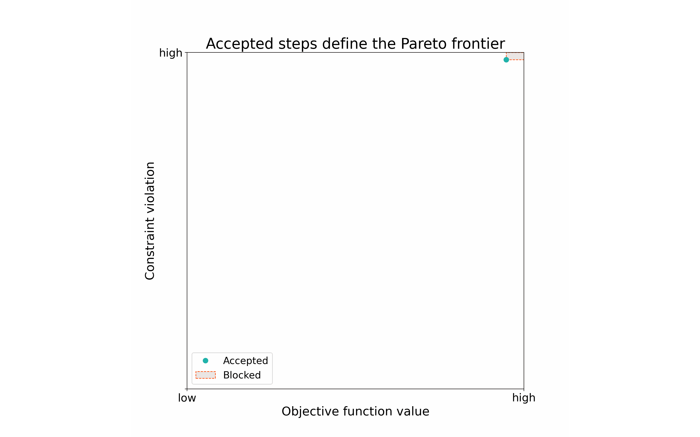

# Line searches, trust regions, learning rates

??? abstract "`optimistix.AbstractSearch`"

    ::: optimistix.AbstractSearch
        options:
            members:
                false

::: optimistix.LearningRate
    options:
        members:
            - __init__

---

::: optimistix.BacktrackingArmijo
    options:
        members:
            - __init__

---

::: optimistix.ClassicalTrustRegion
    options:
        members:
            - __init__

---

::: optimistix.LinearTrustRegion
    options:
        members:
            - __init__

---

::: optimistix.FilteredLineSearch
    options: 
        members:
            - __init__

??? visualisation
    The filtered line search can accept steps if they improve the value of the target
    function, or the constraint violation (feasibility error). To avoid cycling between
    these two objectives and enforce progress toward the solution, the solver may not
    regress in either without improving over previously seen values in the other. 
    A set of these previously seen pairs of values of the target and constraint 
    functions defines the filter, and are compared against the values of these two 
    functions for all proposed steps.

    That is, steps can only be accepted if they improve on points defining the Pareto 
    frontier, otherwise they are blocked by the filter:
    

    The filter can be reset, for example when the allowed step size becomes too small, 
    or by re-initialising the search in solvers with adaptive barrier updates.
---

